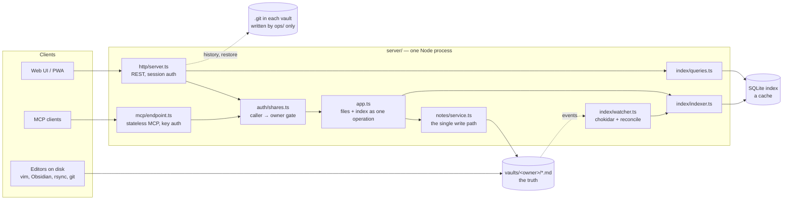

# ndBrain

A self-hosted notes server that is a **librarian, not a better editor**.

Notes are plain Markdown files in a folder. The server indexes them, resolves `[[wikilinks]]`,
and tells you what is drifting: orphaned notes, untagged notes, dead links, notes nobody has
touched in months. Humans use the web UI; agents use MCP with scoped keys. Both read and write
the same files.

**Migration is copying a folder.** The database is a cache and can be rebuilt from the files at
any time — that is the core promise, and it is enforced by a test rather than asserted in a README.

## Status

Rebuilt from scratch in July 2026, replacing an earlier version that grew too large to finish.
The rebuild ran to the end of its plan, and the result has been in daily use since August 2026:
one instance behind a reverse proxy, holding real notes, with agents writing into them over MCP.

| Phase | | |
|---|---|---|
| 0 | Vault core — path safety, tenant boundary, Markdown parsing, single write path | done |
| 1 | Index — SQLite + FTS5, link resolution, file watcher, reconciliation | done |
| 2 | REST API, authentication, web UI, container image | done |
| 3–6 | Search, backlinks, overview, tidy-up, graph views, home, journal and daily notes | done |
| 7 | Sharing between users | done |
| 8 | Installable as an app (PWA) | done; the desktop shell was never built, see below |
| 9 | MCP endpoint with scoped agent keys | done |

Three releases came after the plan ran out: spaces (vaults nobody signs in to), bringing back a
deleted note, and putting the history and backup layer that had only ever lived on the hosts
into this repository as `ops/`.

## Running it

The container image builds from this repository and carries no native dependency.

```bash
docker compose up -d
docker compose exec ndbrain ndbrain-user create julian --admin
```

There is no self-registration: `ndbrain-user` is the only way an account comes into existence,
and it reads passwords from stdin rather than from an argument that would land in `ps`. Run it
with no arguments for the rest — passwords, agent keys, spaces, reindex.

The vault and the index live on the host (`/srv/ndbrain/vaults` and `/srv/ndbrain/index` in
`docker-compose.yml`), so removing the container can never take notes with it. TLS is expected to
be terminated by a reverse proxy in front; `NDBRAIN_COOKIE_SECURE=false` is for a plain-HTTP test
and nothing else, because the browser will otherwise drop the session cookie. That same flag also
decides whether `Strict-Transport-Security` is sent, so a plain-HTTP test cannot pin a browser to
HTTPS for a year — the proxy adds no headers of its own, which is why this one comes from here.
The reverse proxy in front has to **pass WebSocket upgrades** for `/api/v1/collab`, or live
editing is unavailable and every browser silently falls back to saving as before. `NDBRAIN_COLLAB=false`
turns live editing off deliberately, without a code rollback, and is the way back if something
about it misbehaves.

The remaining settings and their defaults are in `server/src/config.ts`, which is short on purpose.

Every response carries a content security policy composed from the page actually being served:
the theme bootstrap in `web/index.html` is allowed by digest, so `script-src` needs no
`'unsafe-inline'`. Change that inline script and the digest follows by itself; see
`server/src/http/csp.ts` for what each directive is there for.

## Layout

```
server/    Node + Fastify, TypeScript. Vault access, index, REST, MCP.
web/       React + Vite UI, installable as an app.
shared/    The API schemas both sides compile against.
desktop/   macOS menu-bar app: the global capture shortcut, in Rust — see desktop/README.md.
ops/       History and backup on the hosts — see ops/README.md.
```

`ops/` is the layer that protects ndBrain from data loss: a timer that commits each vault into a
git repository beside it, a database snapshot, and a pull from the backup host. It is documented
in [ops/README.md](ops/README.md), in German like the scripts themselves, because its reader is
the operator and not the compiler.

## Architecture

One Node process, one folder of Markdown files, one SQLite file. Everything else is a view of
those three.



### Server modules

| Module | Responsibility |
|---|---|
| `vault/paths.ts` | Pure path rules and the tenant boundary. No I/O, so the security-critical part is exhaustively testable. |
| `vault/fs.ts` | Owner-scoped filesystem access. Every method takes an owner, re-checks containment against the real path (symlinks), and writes through a temporary file renamed into place. |
| `notes/service.ts` | The only code that writes to a vault. Holds the per-note lock (`notes/mutex.ts`, keyed by `owner:path`), the case-collision guard and the conflict guard. |
| `app.ts` | Owns the pair of files and index. Every change (put, append, rename with link rewrite, delete, bulk tag) writes the file and reindexes it in one call, so no caller can forget the second half. |
| `index/indexer.ts` | Parses notes (`markdown/`) into the index: titles, tags, links, tasks, properties, FTS5 text. `rebuild` from scratch is the normal recovery, not an emergency tool. |
| `index/watcher.ts` | Picks up edits made outside the server, and reconciles the whole vault every five minutes. |
| `index/queries.ts` | Every read the UI and the agents make. Each query takes an owner or a share view and filters on it in SQL. |
| `auth/` | Accounts, sessions, agent keys, shares and note bindings. `shares.ts` is the gate between the caller and the owner. |
| `collab/` | Live rooms for open notes: one in-memory Yjs document per note, synced with the browsers over `/api/v1/collab`, persisted through `NoteService`. No CRDT state is ever written to disk or to the database — the room is a working copy while the note is open and nothing more. |
| `http/server.ts` | Thin REST layer: decode, name the caller from the session, call `App`, map errors. Every route obtains its owner and path through one function, `target()`, which runs the permission check. |
| `mcp/endpoint.ts`, `mcp/tools.ts` | MCP over stateless Streamable HTTP, implemented directly against the protocol so it sits inside Fastify's auth and error handling. |
| `vault/history.ts` | Reads the git history that `ops/vault-history.sh` maintains. Never writes to it. |
| `db/` | The `node:sqlite` wrapper and the schema with its migrations. Every row carries `owner`, including the FTS table. |
| `runtime.ts` | Wiring shared by the server and the `ndbrain-user` CLI, so both open the same database the same way. |

### What the database holds

Two kinds of tables share one file, and they are treated differently.

- **Derived from the vault:** `notes`, `notes_fts`, `links`, `tags`, `tasks`, `props`. Losing them
  costs a reindex (`ndbrain-user reindex`) and nothing else. A migration may drop and rebuild them.
- **Not derivable:** `users`, `sessions`, `api_keys`, `shares`, `user_settings`, and the logs
  `edits` and `access_log`. These are why the database is backed up at all, and why `reindex`
  rebuilds the first group without touching the second.

### A write, end to end

1. The editor buffers keystrokes and sends one debounced `PUT` with the text and the `baseHash`
   of the version it started from (`web/src/useNoteBuffer.ts`).
2. `http/server.ts` resolves the caller from the session, and `target()` asks the share gate
   whether this caller may write to this owner's note. A refusal answers "not found".
3. `NoteService` takes the lock for `owner:path`. If the file no longer holds the text named by
   `baseHash`, the version about to be displaced is written out as a conflict copy first.
4. The new text goes to a temporary file in the same directory and is renamed over the note.
5. `App` reindexes the note and logs the edit in `edits`, still inside the same operation.
6. The watcher sees its own write a moment later, compares the content hash with the index,
   finds nothing new and does nothing. No time window, no ignore list.
7. Within two minutes the history timer on the host commits the vault; within fifteen, the
   backup host pulls it.

### How changes reach the browser

An **open note syncs live** over a WebSocket. Everything else is polled.

While at least one editor has a note open, the server keeps a room for it: one `Y.Doc` with the
note's text, in memory. Browsers join it at `GET /api/v1/collab?owner=…&path=…` and exchange
`y-protocols` sync and awareness messages, so text, cursors and names appear in each other's
editors within a few dozen milliseconds. Every other way a note's content can change — REST, MCP,
a bulk action, the link rewrite of a rename, an edit made on disk — is routed into the room while
it exists, as either a transform of the live text or a three-way merge for a writer that started
from an older version. The room writes the result out through the ordinary `NoteService` path at
most a second after the last change, so the lock, the index, the edits log, the history sidecar
and the backup are unchanged.

A room is a tool, not a store. It is filled from the file when the first editor arrives and thrown
away when the last one leaves, and the `.md` file stays the only truth.

This also makes ndBrain a **single process**. Rooms live in the memory of the one server, like the
watcher, so it cannot run behind a load balancer with several instances.

A note with no socket runs exactly as it did before: `NDBRAIN_COLLAB=false`, a proxy that does not
pass upgrades, a note larger than the socket's 8 MiB frame, or a process already holding its limit
of open rooms all end in the same place — the editor says *Live editing unavailable — saving as
usual* and saves with a `baseHash`, which the server three-way merges into the room if one is open
and otherwise handles as it always has, with a conflict copy.

The polled mechanisms remain, each for a different kind of change.

- **Changes you make yourself** invalidate the affected TanStack Query entries explicitly
  (tree, tidy-up, links, graph). Anything else counts as fresh for 30 seconds.
- **Activity by others** comes from `GET /api/v1/pulse`, polled every two seconds (adjustable in
  settings) while the brain view or a note is on screen, and not at all otherwise. It returns the
  owner's writes from `edits` and agent reads from `access_log` since the last poll, with the
  server's clock as the cursor. The brain lights up those notes, and the note view's
  neighbourhood does the same.
- **Changes on disk** (rsync, `git pull`, vim over SSH) reach the index through the watcher within
  about a quarter of a second, or through the next reconcile if the watcher missed them. The
  browser sees them on its next fetch.
- **The open note's own version** comes from `GET /api/v1/version/<path>`, on the same interval
  and only while a note the caller may *write* is open and the tab is in the foreground. It
  answers one thing — the `hash` of the file right now — and the editor compares it against the
  version it was filled from. Deliberately not part of the pulse: the pulse answers for the
  caller's own vault only, because when somebody works and on what is information about that
  person, and the case this is for is a note shared for writing in *somebody else's* vault. So
  the question is narrowed instead of the pulse widened: one named note, one fact, no actor and
  no time.

**Without a room**, an open note is never re-read underneath the editor. Replacing text while
somebody types is worse than showing text that is a few seconds old. (With a room this question
does not arise: the editor and the room hold the same text, and a change from anywhere arrives as
an operation at the place it happened rather than as a new copy of the whole note.) Opening a note always fetches it fresh, and if
someone else changed it in the meantime, the next save does not overwrite their version: the
`baseHash` no longer matches, and the displaced text is kept as a conflict copy that shows up in
*Tidy up*. A bar under the header says so **before** that save, so the copy can be avoided rather
than only explained; it offers to load the other version, and asks first when there is text in
the editor that has not been written yet.

### Web client

React and Vite, TanStack Query for server state, CodeMirror 6 as a Markdown source editor with a
live preview (`web/src/editor/`). `App.tsx` holds the shell and the views; `useNoteBuffer.ts` holds
the one hard promise in the client, that typed text does not go missing (debounced writes,
retry on failure, `keepalive` and `beforeunload` on the way out). The brain view (`web/src/brain/`)
is a canvas renderer over the link graph from `GET /api/v1/graph`: layout, clustering, edge
bundling and hit testing are plain TypeScript, with no graph library. `shared/schema.ts` holds the
zod schemas both sides compile against, so a response the client cannot parse fails loudly at the
boundary.

## Multi-tenant from the ground up

Every user gets their own vault directory. This is a security boundary, not a convenience:
ndBrain is meant to be self-hosted by strangers, so one user must never be able to reach
another's notes — not through a path, not through search, not through a wikilink, and not
through the difference between "not found" and "not allowed".

The vault layer has no function that does not take an owner, and every index row carries one.

## Sharing: vaults, folders, notes and spaces

Sharing splits "owner" into two things that stay apart: the **caller** making the request, and
the **owner** whose vault the note lives in. Every vault and index function still takes the
owner; a gate in front decides which owners a caller may reach and how. The boundary above is
therefore not weakened by sharing, it is the same boundary with an explicit, revocable list of
doors in it.

A share covers a whole vault, one folder, or exactly one note. The three cases are one rule in
one function, `inScope`, with a SQL twin beside it that every query filters on, and a test that
asks both about the same paths so the two cannot drift apart unnoticed. A refusal is always
"does not exist", never "not allowed": a caller who can tell those apart can map out the parts of
a vault they were never shown.

A **space** is a vault that belongs to nobody. Nobody signs in as one and it has no password;
an administrator creates it and adds members, who see it beside their own vault. It is where
notes live that are not one person's — a household, a team, a shared project.

A write-shared note has real conflicts, and the answer is last-writer-wins. The incoming text
lands, the version it displaced is written out beside it as a conflict copy and indexed like any
other note. Nothing is merged: a merge that gets it wrong is worse than two files, because it
looks finished. While such a note is open, the editor also polls its version and warns before the
save rather than only after it — see *How changes reach the browser*.

## Agents

`POST /mcp` is a general MCP endpoint, not one integration. Any client can point at it — Claude
Desktop, an editor plugin, somebody else's agent.

Access is a key, not an account. A key belongs to an owner and may narrow further, by path scope
and by a read/write flag, so a key can only ever see less than its owner and never more. Every
call is checked twice, against the owner's vault boundary and against the key's own scope. The
secret is shown once and stored only as a SHA-256 hash, and every tool call is logged, so the
owner can see what their agents actually did.

A key also runs out. A year by default, choosable per key when it is made (`--days`, or
`--forever` for something unattended like a monthly job), and the keys that existed before this
kept no deadline rather than being given one retroactively. An expired key is refused exactly as
an unknown one is, so nothing about the answer says a real key was presented — the admin view and
the server log are where the deadline is visible, and the log names the key a fortnight ahead
together with the command that replaces it.

The tools are `search_notes`, `get_note`, `list_notes`, `vault_map`, `get_links`, `list_tasks`,
`list_findings`, `create_note`, `append_note`, `edit_note`, `rename_note` and `delete_note`. An
agent that can only ever add makes tidying work it cannot take part in, so it can clear up after
itself too — a delete through MCP lands in *Recently deleted* like any other, and `delete_note`
says in its answer whether a saved version to bring back actually exists. `list_findings` is the
other half of that: it hands over the broken links, the notes nothing points at and the untagged
ones, so the tidying can be asked for rather than discovered by reading the whole vault back.

## Design notes worth knowing before reading the code

- **Case-sensitivity is checked against real directory entries, never `stat`.** `stat` folds case
  on Windows and macOS but not on Linux, so the same code would otherwise take a different branch
  per platform. Two notes whose names differ only in case are refused, because that pair cannot
  survive being copied onto either of those systems.
- **Change detection compares content hashes, not timestamps.** A restore, a `git checkout` or an
  rsync can leave a changed file with an older mtime. This holds for the index *and* for the
  conflict guard: a read hands out the note's `hash`, a write names it as `baseHash`, and the
  version being displaced is kept as a copy whenever the file no longer holds that text. A write
  that sends only the `baseMtimeMs` the protocol used to carry is a browser tab from before this
  changed, and is answered as well as a clock allows.
- **The file watcher is for latency, not correctness.** Watchers lose events — inotify limits,
  network shares, and write-settling that withholds a file created and deleted inside its window.
  A periodic reconciliation pass is what actually guarantees the index matches the vault.
- **Unresolved links are kept.** A link into the void is a finding to report, not an error to discard.

## Note shares and editing files outside ndBrain

A note share grants another user (or an MCP key) access to one specific note. That grant is bound
to the file itself, not just its path: the share is confirmed against the file's identity and
content hash before every read and before every write ndBrain makes to that path. This is a
security boundary, not an implementation detail — a path alone cannot prove that the file behind
it is still the note the owner meant to share, so ndBrain refuses to carry a grant across a file
it cannot vouch for.

This means a note share is withdrawn when a file is externally replaced rather than edited in
place — for example when an editor deletes the file and writes a new one at the same path on save.
**vim does this by default.** Add `set backupcopy=yes` to your vimrc so vim edits the existing file
instead of replacing it, and shares on notes you edit with vim survive the save. VS Code, nano and
Obsidian all edit in place and are unaffected.

If the replacement file's content is at least 64 bytes of non-whitespace and matches what the
share was bound to, ndBrain treats it as the same note restored (a `git checkout`, a copy from
backup) and keeps the share. Below that size the rescue is not reliable enough to trust, so the
share is withdrawn.

## What is not built

Worth knowing before reading the code, because some of it is conspicuous by its absence.

- **No AI anywhere in the product.** Not an embedding, not a model call, not a semantic search.
  `grep -rniE 'embedding|openai|anthropic' server/src web/src shared` returns nothing, and that is
  the honest state rather than an oversight waiting to be fixed. Search is SQLite FTS5 over title
  and body plus the link structure; the brain view is a layout of that link graph, not a model.
  Agents come to ndBrain through MCP and bring their own intelligence with them.
- **No desktop application that shows notes.** `desktop/` is a Tauri v2 menu-bar app, and it is
  only the global capture shortcut — it has no window that loads ndBrain. An installed PWA is
  already a chromeless window with its own icon, so a WebView there would have been a second place
  to be signed in and a second cache to go stale in exchange for nothing. Its menu opens ndBrain in
  the browser. See [desktop/README.md](desktop/README.md).
- **No offline notes.** The service worker exists for startup speed and installability. Anything
  under `/api/` never touches the cache in either direction, because serving a cached note would
  be showing somebody text that may have changed with no way for them to tell.
- **No offline editing beyond a short disconnect.** What is typed while the socket is down is held
  and sent — into the room when it comes back, or through the ordinary save path if the room was
  rebuilt meanwhile. Nothing is kept for a tab that is closed and reopened later.
- **No second server process.** Rooms for open notes live in the memory of the one process, so
  ndBrain does not run behind a load balancer with several instances.
- **No live collaboration on anything but note text.** No live tree, no live rename dialog, no
  comments, no suggestions, and no per-character view of who wrote what.
- **No history of its own.** The version history and the way back from a delete are read out of
  the git repository that `ops/vault-history.sh` maintains beside each vault on the host. ndBrain
  only reads it: the timer owns every commit, so a git that is broken or missing degrades the
  history view to "not available" and cannot stop a note from being saved. Without that timer
  there is no history at all.
- **No backup inside the application**, and the layer that does it has its own limit written
  down in [ops/README.md](ops/README.md): up to two minutes of writing is not covered by it.
- **No sign-up, no email, no second factor.** An administrator creates accounts, and a forgotten
  password is reset by one. There is nothing in here that sends mail, so there is no reset link
  to send.

## Development

```bash
cd server
npm install
npm test          # unit and integration tests
npm run typecheck # npm test does not typecheck
npm run smoke     # builds a realistic vault, asserts byte-identical reads and no tenant leak
```

The UI has its own suite in `web/` (`npm install && npm test`), and `npm run dev` there serves
the interface against a server started separately on port 3000.

Requires Node 22 or newer. There is no native dependency: SQLite comes from Node's built-in
`node:sqlite`, deliberately, so that self-hosting never requires a C++ toolchain.

The Mac client in `desktop/` is the one part that needs a compiler, which is what it is for, and it
is not needed to run or host ndBrain:

```bash
cd desktop
cargo test        # all three crates
cargo build       # an unsigned debug binary
```

Rust 1.90 or newer. `cargo test -p ndbrain-capture` is the fast loop — that crate holds the
decisions and depends on nothing, so it does not compile Tauri.

## Licence

Apache License 2.0 — see [LICENSE](LICENSE) and [NOTICE](NOTICE).

There is no API stability promise while the version is `0.x`. Security boundaries are not covered
by that caveat: those are treated as requirements, not as work in progress.
